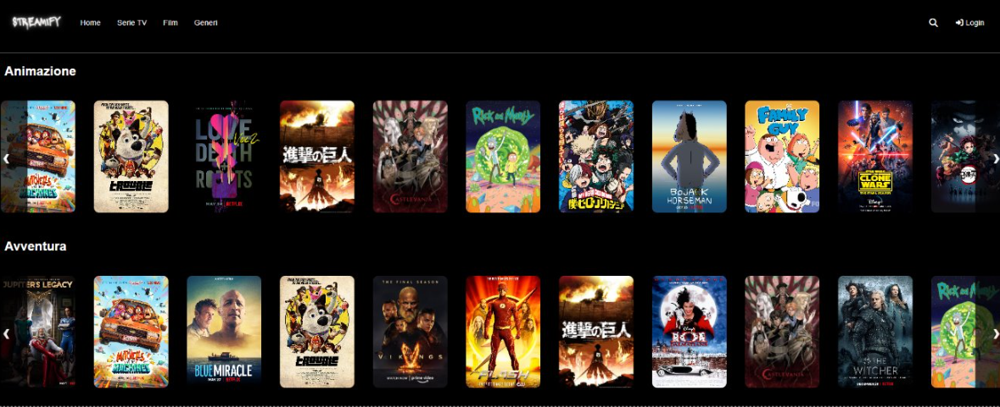
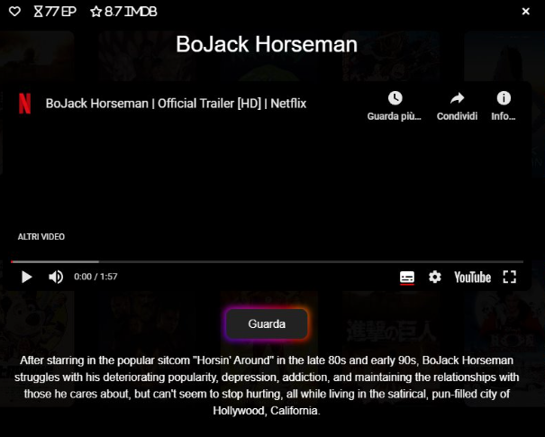
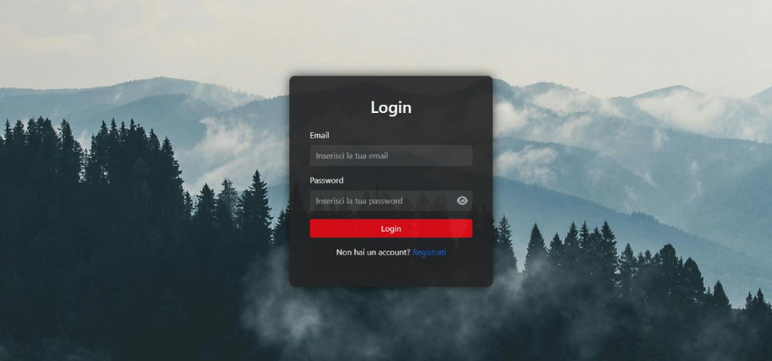

  

<h1 align="center">🎬 Streamify</h1>

A streaming platform similar to Netflix built by using ASP.NET Core MVC

---

## 🚀 Main features
- 🔍 Search for a content by writing the title
- 🎥 Trailers using the YouTube API
- 🧠 Login, Register
- ❤️ Create a list of favourite contents
- 🕒 Smart history

---

## 📸 Screenshots

### 🏠 Homepage

### 📺 A content

### 🔐 User Login

---

## 🧰 Tech Stack 
- **Backend**: C# + ASP.NET Core MVC
- **Database**: SQL Server con Dapper
- **Frontend**: Razor Pages, HTML/CSS, JavaScript

---
